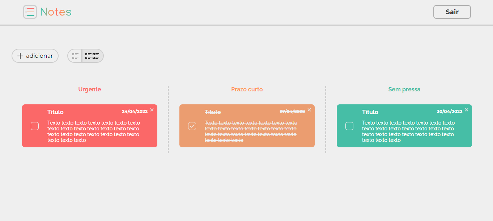
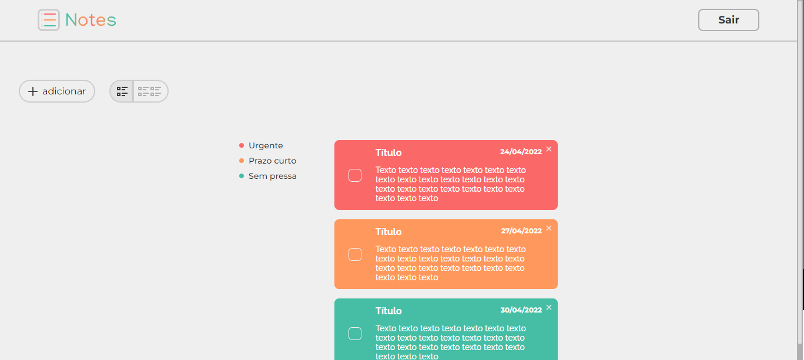

<p align="center" >
    
</p>

# Notes
- Esse projeto consiste em um site simples para organizar a sua lista de afazeres, podendo dividir as tarefas por 3 categorias. Cada usuário tem sua própria lista e o cadastro é feito com email e senha.

    Esse foi um projeto independente desenvolvido com a função de aprimorar os conhecimentos obtidos através de estudos e dúvidas sobre as tecnologias.

## 🧪 Tecnologias
- [React](https://reactjs.org/)
- [React Router](https://reactrouter.com/)
- [Firebase V9](https://firebase.google.com/)
- [TypeScript](https://www.typescriptlang.org/)
- [LottiFiles](https://lottiefiles.com/)

## 🔮Layout
- Você pode conferir o design do projeto no [figma](https://figma.com/) clicando [aqui](https://www.figma.com/community/file/1099774546666132917).
    
    
    
## 🚀 Como executar
Clone o projeto e acesse a pasta criada.

```bash
$ git clone https://github.com/Luanzacarias/notes.git
$ cd notes
```

Faça o download das dependências e start
```bash
# Install the dependencies
$ yarn
# Start the project
$ yarn start
```

O app estará disponível no seu browser pelo endereço http://localhost:3000.

## 📄Detalhes
- Será necessário criar uma conta no [Firebase](https://firebase.google.com/) e um projeto para disponibilizar um Realtime Database e Autenticação com email e senha. 
- Além de preencher corretamente os dados necessários na pasta `.env` com os dados disponibilizados pelo [Firebase](https://firebase.google.com/) sobre seu projeto.
